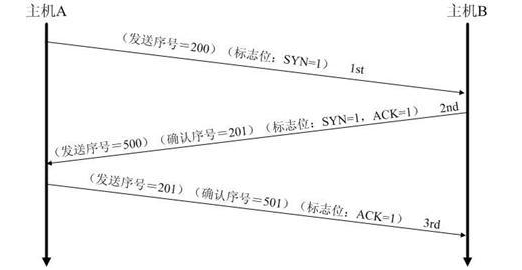

### TCP的滑动窗口

为了提高信道的利用率TCP协议不使用停止等待协议，而是使用连续ARQ协议，意思就是可以连续发出若干个分组然后等待确认，而不是发送一个分组就停止并等待该分组的确认。
TCP的两端都有发送/接收缓存和发送/接收窗口。TCP的缓存是一个循环队列，其中发送窗口可以用3个指针表示。而发送窗口的大小受TCP数据报中窗口大小的影响，TCP数据报中的窗口大小是接收端通知发送端其还可以接收多少数据，所以发送窗口根据接收的的窗口大小的值动态变化。

### TCP流量控制
运用TCP报文段中的窗口大小字段来控制，发送方的发送窗口不可以大于接收方发回的窗口大小。TCP为每一个连接设置一个持续计时器探测窗口值避免死锁。（接收方发送非零窗口报文在途中丢失）

### TCP拥塞控制
- 拥塞窗口：发送方为一个动态变化的窗口叫做拥塞窗口。
- 拥塞避免：发送窗口会随着拥塞窗口缓慢增加（+1）。
- 慢启动算法：每收到一个确认拥塞窗口便翻倍。慢开始门限ssthresh状态变量限制上限值。也是拥塞避免启动值。

### TCP粘包现象？
- 描述：发送方发送的若干包数据到接收方接收时粘成一包，从接收缓冲区看，后一包数据的头紧接着前一包数据的尾。
- 原因：TCP默认会使用Nagle算法会收集多个小分组，在一个确认到来时一起发送。而接收方在接收到数据时是先到缓存，由应用程序读取。
- 解决：
    - 发送方关闭Nagle算法（降低网络传送效率，不建议使用）。
    - 接收方只能从应用层想办法。
        - 应用层解决办法：循环处理：应用程序在处理从缓存读来的分组时，读完一条数据时，就应该循环读下一条数据，直到所有的数据都被处理；
        - 三种方式处理数据：
            1. 格式化数据（开始和结束符）-->容易和数据内的符号混淆
            2. 增加长度说明数据，将消息分为消息头和消息体，消息头中的第一个字段使用int值表示长度
            3. 消息固定长度传输

### 介绍一下TCP的三次握手？每次发送了什么信号？如果去掉最后一次握手会怎样？

如果去掉最后一次握手会出现延误的客户端申请链接的包被确认连接，导致服务器等待浪费资源。

### 为什么4次挥手？
根本原因是，一方发送FIN只表示自己发完了所有要发的数据，但还允许对方继续把没发完的数据发过来。

### 如何处理服务器大量端口处在timewait？
允许将TIME-WAIT sockets重新用于新的TCP连接

### tcp的11种状态？

特殊状态closing,双方都接收到对方的Fin报文。

### 为什么有TIME_WAIT状态且要保持2MSL长的时间？
1. 为了保证客户端发送的最后一个`ACK`报文段能够到达服务器端。客户端最后发送的这个`ACK`报文段有可能在网络传输中丢失，因而是处在`LAST-ACK`状态的服务器端收不到对已发送的`FIN+ACK`报文段的确认。服务端会超时重传这个`FIN+ACK`报文段，而客户端就能在2MSL时间内收到这个重传的`FIN+ACK`报文段。接着客户端重发一次`ACK`报文，重新启动2MSL计时器。最后，客户端和服务端都正常进入`CLOSED`状态。如果客户端在`TIME-WAIT`状态不等待一段时间，而是在发送完`ACK`报文段后立即释放连接，那么就无法收到服务端重传的`FIN+ACK`报文段，因而也不会再发送一次确认报文。这样服务端就无法按照正常步骤进入`CLOSED`状态。
2. 防止已失效的连接请求报文，出现在本连接中。客户端发送完最后一个`ACK`报文段后，再经过时间2MSL，就可以使本连接持续的时间内产生的所有请求都从网络中消失。这样就可以使下一个新连接中不会出现这种旧的连接请求报文段。

### TCP如何保证可靠传输？
1. 三次握手
2. 超时重发
3. 流量控制
4. 拥塞控制

